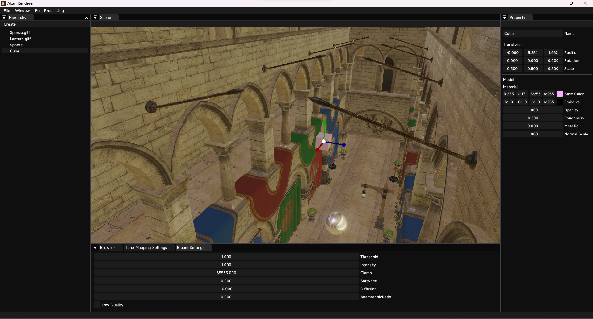
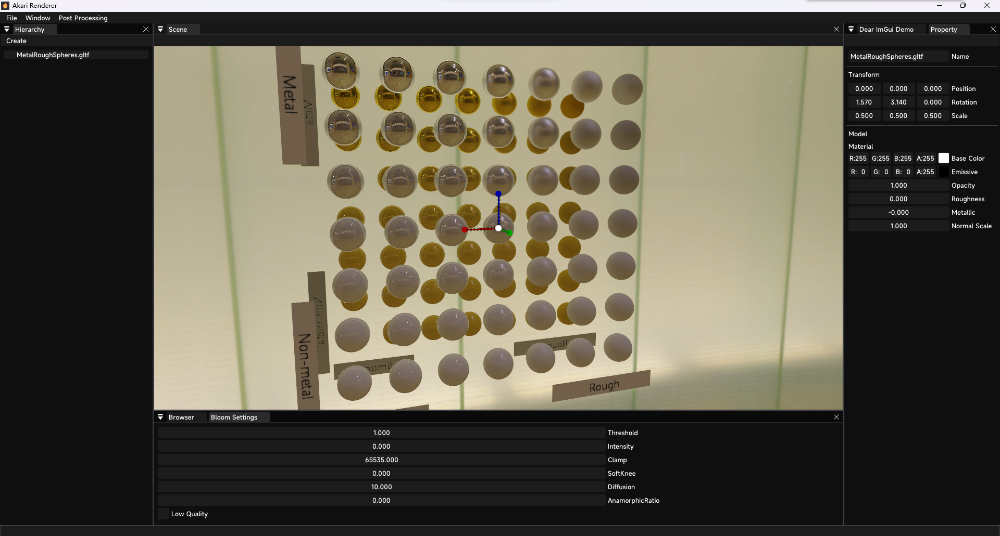

# Akari Renderer
This is an under developing DirectX 12 toy renderer created for testing graphics features, contains framework code from [LearningDirectX12](https://github.com/jpvanoosten/LearningDirectX12), [Hazel](https://github.com/TheCherno/Hazel) and [DirectX-Graphics-Samples](https://github.com/microsoft/DirectX-Graphics-Samples).

## Build
Since DirectX is a Windows library, Akari Renderer supports **WINDOWS 10/11 ONLY**. To generate dependency projects, make sure you have CMake tools properly installed on your PC, or you can use `Visual Studio 2022 Developer PowerShell` which has CMake embedded.

### Clone
Run `git clone --recursive https://github.com/Cutano/ProjectAkari.git` to clone Project Akari and it's dependencies.

### Generate Dependency Projects
Run  `.\GenerateDepsProj.bat` before opening the solution. (CMake required)

### Build
Use Visual Studio 2022 to build the solution, if you want to use DirectX Debug Layer, make sure you got Graphics Tools installed.

## Screenshots

## Current Features

### Lighting
- [x] Punctual Lighting
- [x] Image Based Lighting
- [x] Kulla-Conty Approximation
- [ ] Spherical Harmonics Lighting

### Rendering
- [x] Physically Based Rendering
- [ ] Toon Shading
- [ ] Particles

### Postprocessing
- [x] High Quality Bloom
- [x] Tone Mapping
- [ ] Depth of Field With Bokeh

### Global Illumination
#### Specular GI
- [ ] SSR / SSGI
#### Diffuse GI
- [ ] DDGI / RTXGI
#### Ambient Occlusion
- [ ] GTAO
- [ ] Capsule AO

### Anti-Aliasing
- [x] MSAA
- [ ] TAA

### Render Pipeline
- [x] Forward Opaque
- [ ] Forward Transparent
- [ ] Deferred

### Model
- [x] Simple Geometry
- [ ] Model Loading
- [ ] Model Animation

### Material
- [x] Built-in PBR Material
- [ ] Material Ball

### Scene
- [x] Editor
- [ ] Save & Load

### Settings
- [ ] Auto Save & Load 